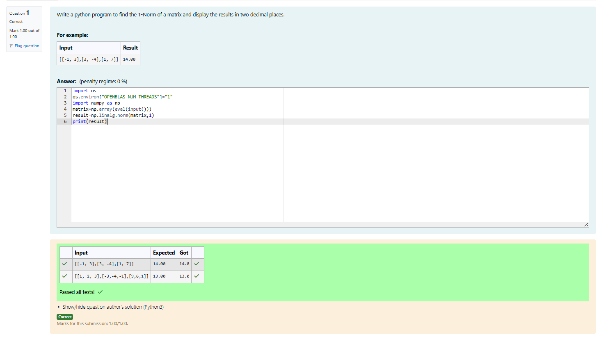
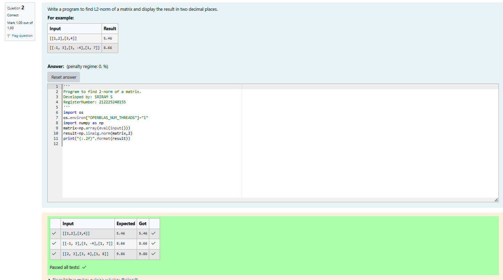
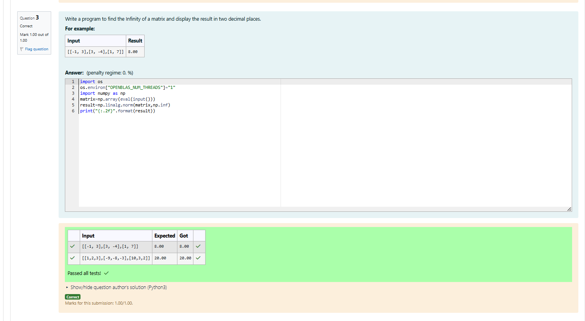

# Norm of a matrix
## Aim
To write a program to find the 1-norm, 2-norm and infinity norm of the matrix and display the result in two decimal places.
## Equipment’s required:
1.	Hardware – PCs
2.	Anaconda – Python 3.7 Installation / Moodle-Code Runner
## Algorithm:
	1. Get the input matrix using np.array()   
    2. Find the 2-norm of the matrix using np.linalg.norm()
	3. Print the norm of the matrix in two decimal places.
## Program:
```Python
# Register No:212225240155
# Developed By: SRIRAM S
# 1-Norm of a Matrix

import os
os.environ["OPENBLAS_NUM_THREADS"]="1"
import numpy as np
matrix=np.array(eval(input()))
result=np.linalg.norm(matrix,1)
print(result)

# 2-Norm of a Matrix


import os
os.environ["OPENBLAS_NUM_THREADS"]="1"
import numpy as np
matrix=np.array(eval(input()))
result=np.linalg.norm(matrix,2)
print("{:.2f}".format(result))


# Infinity Norm of a Matrix


import os
os.environ["OPENBLAS_NUM_THREADS"]="1"
import numpy as np
matrix=np.array(eval(input()))
result=np.linalg.norm(matrix,np.inf)
print("{:.2f}".format(result))


```
## Output:
### 1-Norm of a Matrix
<br>

<br>
<br>

### 2-Norm of a Matrix
<br>
<br>

<br>

### Infinity Norm of a Matrix
<br>
<br>

<br>

## Result
Thus the program for 1-norm, 2-norm and Infinity norm of a matrix are written and verified.
